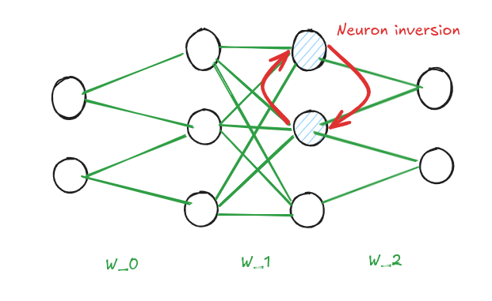
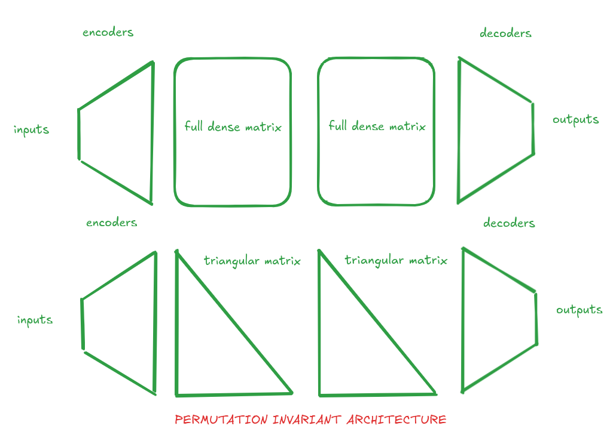
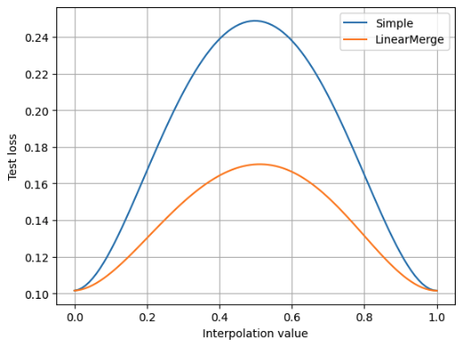

### Idea of the linearmerger layer

The key idea of the linearmerger layer is to be able to merge / average two layers / models of the same size after training.
It is well know that such models / layers fusion don't give good results because of multiple reasons.

See the surver here : Deep Model Fusion: A Survey (https://arxiv.org/pdf/2309.15698)

Why is that ?

Well the main reason is that there are multiple symetries in neural networks.
Two multiples neural networks (with the same archi but different weights) can produce the same outputs for the same input.

Here is an simple illustration of such case :

Basicly the idea is that if you switch two neurons witht the correspond matrix weight, you will get the same output but you get two different models.

The problem now is that if you get two different models, you can't average them because they could be the same but with one weight perturbation (which render the average useless).

The big hypothesis of neural networks training is that converge to the same solution MODULO the symmetries of the network.

### The solution

The solution is to use the linearmerger layer instead of the classic dense / linear layer.
The linearmerger layer is a triangular matrix that will be used to merge / average two layers / models.

The idea is that imposing a triangular structure to the matrix will break the symetry of the network and make the two models different.

The architecture change consists in such transformation :

### First results

We observe an improvment in model merging compare to classic Linear layer :

The average of the two models based on LinearMerge layer is better than the simple average of the two models based on Linear layer.
But yet it is not satisfying (there is still a lot of difference).

### Application

Such architecture modification can enhance the merging power of the model and could improve applications such as

- federated learning (model can be merged on the server instead of simply averaging the gradiants)

